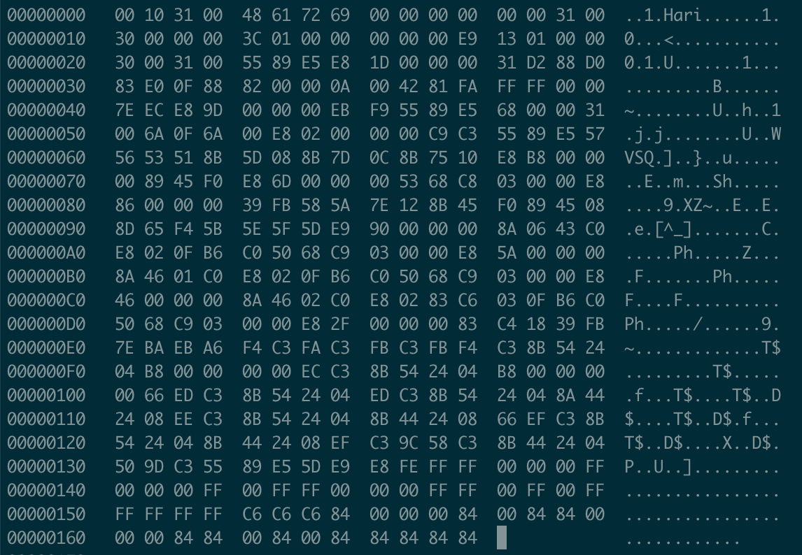

## 色号设定
### 目标：画操作系统页面
1. 设定颜色
2. 8位颜色模式映射32位颜色模式
3. 使用out指令设置调色板（彩色显示器硬件存储）
4. 声明颜色查找表（16*3 = 48字节）

|索引|RGB|颜色|索引|RGB|颜色|
|----|----|----|----|----|----|
|0|`000000`|黑色|8|`c6c6c6`|亮灰|
|1|`ff0000`|红色|9|`840000`|暗红|
|2|`00ff00`|绿色|10|`008400`|暗绿|
|3|`ffff00`|黄色|11|`848400`|暗黄|
|4|`0000ff`|蓝色|12|`000084`|暗蓝|
|5|`ff00ff`|紫色|13|`840084`|暗紫|
|6|`00ffff`|青色|14|`008484`|暗青|
|7|`ffffff`|白色|15|`848484`|暗灰|
5. 设置前禁止中断，设置后恢复中断标志
### 调色板（palette）
有一个长宽各为200个象素，颜色数为16色的彩色图，每一个象素都用R、G、B三个分量表示。因为每个分量有256个级别，要用8位(bit)，即一个字节(byte)来表示，所以每个象素需要用3个字节。整个图象要用200×200×3，约120k字节！如果我们用下面的方法，就能省的多。因为是一个16色图，也就是说这幅图中最多只有16种颜色，我们可以用一个表：表中的每一行记录一种颜色的R、G、B值。这样当我们表示一个象素的颜色时，只需要指出该颜色是在第几行，即该颜色在表中的索引值。举个例子，如果表的第0行为255，0，0(红色)，那么当某个象素为红色时，只需要标明0即可。让我们再来计算一下：16种状态可以用4位(bit)表示，所以一个象素要用半个字节。整个图象要用200×200×0.5，约20k字节，再加上表占用的字节为3×16=48字节.整个占用的字节数约为前面的1/6。这张R、G、B的表，就是我们常说的调色板(Palette)，另一种叫法是颜色查找表LUT(Look Up Table)，似乎更确切一些。
### 软盘存储（静态）和运行时内存（动态）布局

|文件|软盘存储位置|运行时位置|文件作用说明|
|--|--|--|--|
|ipl10.nas|`0 - 199`|`7c00 - 7dff`| 将10个柱面 也就是 `C0-H0-S1` - `C9-H1-S18` 也就是 `0-2cfff` 一共 `18*2*10*512 = 180kb` 加载到 `8000 - 34fff`，最后jmp到软盘内容开始处`4200`（`c200`）|
|asmhead.nas|`4200 - 432f`|`c200 - c32f`|1. 禁止PIC中断和CPU内部中断； 2. 打开允许使用4GB内存开关（16位只能使用1MB内存）； 3. 设定临时GDT，为分段做准备（只有2个段，第一个起始地址0，结束地址`ffffffff`，长度4GB，系统专用，可读写不可执行，第二个起始地址`0x280000`，结束地址`0x2fffff`，长度512kb，系统专用，可执行，可读不可写）； 4. 设定CR0，进入32位分段保护模式； 5. 刷新CPU管道，按照保护模式重新解释指令； 5. 将除CS之外的段寄存器都设置为8，8（gdt+1, 一个段占用的长度是8字节）代表的是第一个段； 6. 构建代码区：将asmhead.nas后的内容（512kb），也就是bootpack.c，拷贝到`0x280000`处，也就是第二个段所在的内存区域； 7. 保存磁盘内容：将磁盘开始的10个柱面，也就是180kb复制到`0x100000`处； 8. 构建静态存储区：对bootpack.hrb进行解析，bootpack.hrb的第16号地址保存着要复制的字节数，20号地址保存着具体数据的开始地址，12号地址存储着静态存储区的开始地址，这里是`0x310000`，如果要复制的字节数大于等于1，则进行拷贝，至少拷贝4个字节； 9. 构建栈区，将12号地址作为栈顶； 10. jmp到第二段的`0x0000001b`处，也就是`0x28001b`，开始执行main方法内逻辑
|naskfunc.nas|`4414 - 4462`|`c414 - c462` `104414 - 104462` `2800e4 - 280132`|供c语言调用，实现c无法实现底层功能|
|bootpack.c|`4330 - 449b`|`c330 - c49b` `104330 - 10449b` `280000 - 28016b`||
### bootpack.c布局

|起始地址|长度|内容|说明|
|----|----|----|----|
|0 - b|12||未知含义|
|c - f|4|00 00 31 00|栈顶和静态存储区起始地址|
|10 - 13|4|30 00 00 00|静态存储区的字节数，或者说要复制的字节数，颜色查找表的大小，48字节|
|14 - 17|4|3c 01 00 00|要复制内容的开始地址|
|18 - 1a|3|00 00 00|未知含义|
|1b - 1f|5|e9 13 01 00 00|jmp 0x280133|
|20 - 23|4|30 00 31 00|未知含义|
|24 - 48|37||HariMain()|
|49 - 5b|19||init_palette()|
|5c - e3|136||set_palette()|
|e4 - 132|79||naskfun.nas|
|133 - 13b|9|55 89 e5 5d e9 e8 fe ff ff |push ebp push ebp,esp pop ebp jmp 0x280024 |
|13c - 16b|48||颜色查找表|
